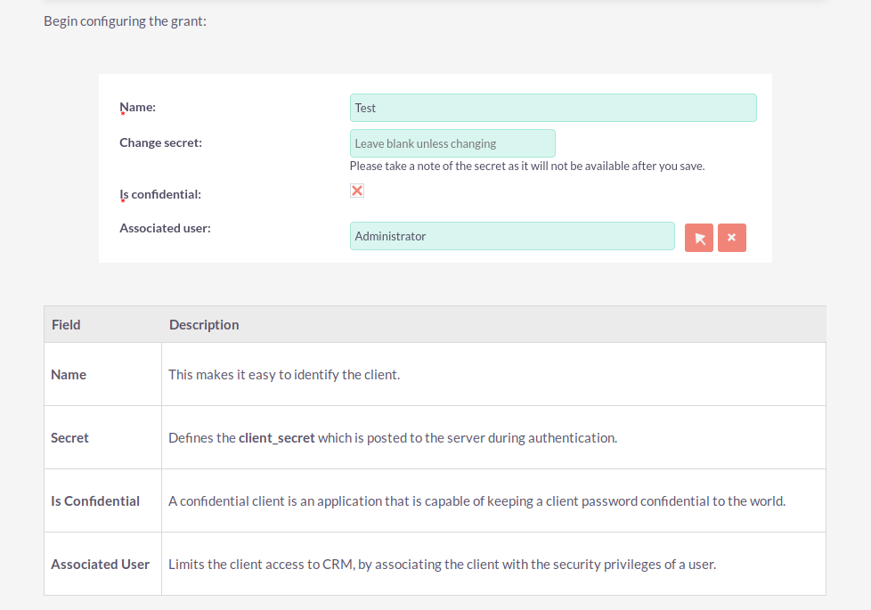

 ## 1.-  How to configure authentication, obtaining a session and chosing grant types in V8 api suitecrm.

* Administrador
* OAuth2 Clients and Tokens
* New Client Credentials Client

This option let us associated the oauth client to a suitecrm user so that we can inherit the suitecrm user permissions.

* Name: oauthclient1
* Change secret: Eefaereer7ah
* Is confidential: Yes
* Associated user: apiclient1

Once the oauthclient1 oauth client is created you should write down:

* Its ID (e.g. 1d3e8a32-3caf-99f7-b9f9-5d764c8f813b) which it's shown after creating it.
* Its secret (what you just typed in the 'Change secret' field).

you will need both of those fields later.