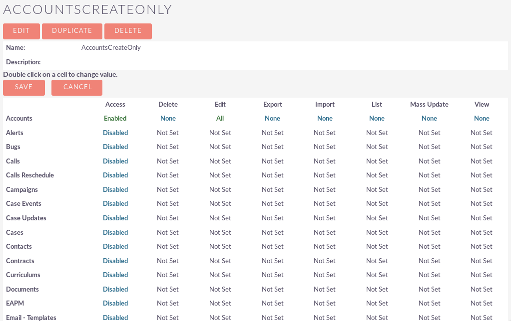
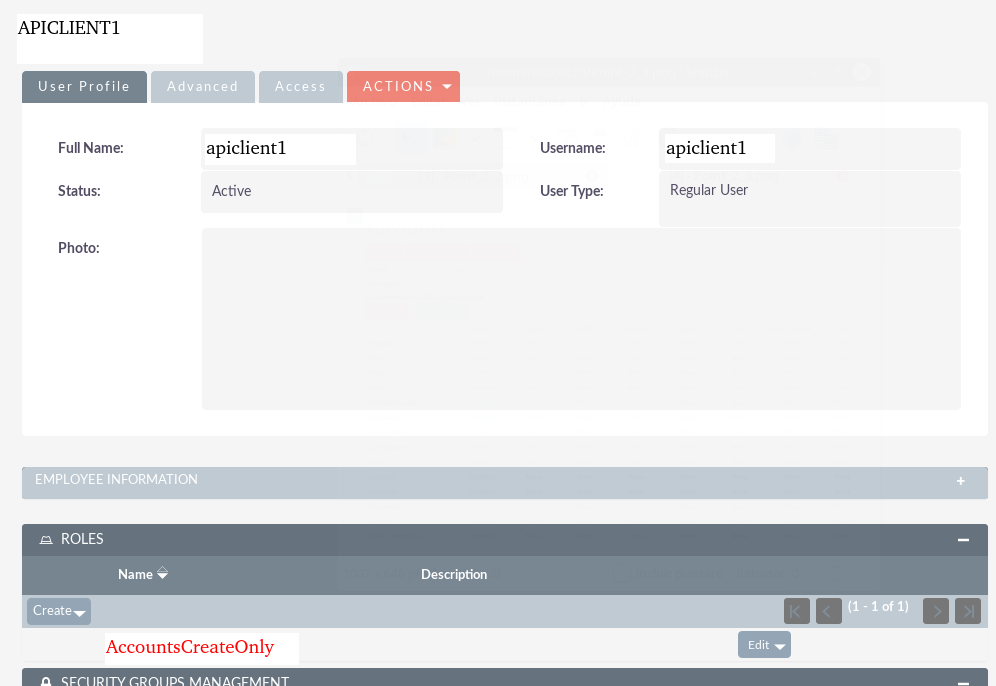

How to configure the user to only have permissions to create objects from the accounts module.

As an admin, create the user that will have the accounts limitation.

* Admin
* User Management
* Create new user

Name the user as: *apiclient1*. Give it a random password. We do not need it later.

As an admin, create the role that will have the permissions.

* Admin
* Role Management
* New Role

Name the role as: *AccountsCreateOnly*.

In the next screen after the creation of the role, you will have to toggle every module Access to be "Disabled" except for Accounts module.

Accounts modules needs:
* Access: Enabled
* Edit: All
* Any other role: None

Assign the role to our newly created user.
You just need to open the user and add the new role to its roles subpanel.

If needed, you can create a security group that has this new role assigned to it.