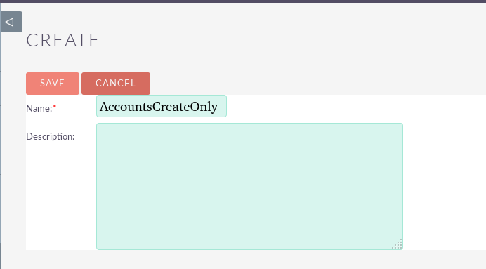

How to configure the user to only have permissions to create objects from the accounts module.

As an admin, create the user that will have the accounts limitation.

As an admin, create the role that will have the permitions.

In the next screens after the creation of the role, you will have to toggle every option to be "Disabled" or "None", except for the Access option for Accounts, which should be "Enabled" module and the Edit option in the same module, which should be "All".

Assign the role to our newly created user.

If needed, you can create a security group that has this new role assigned to it.